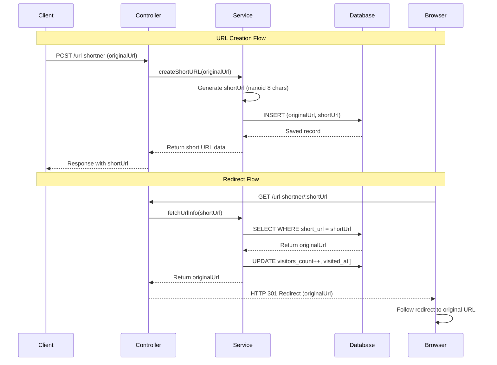
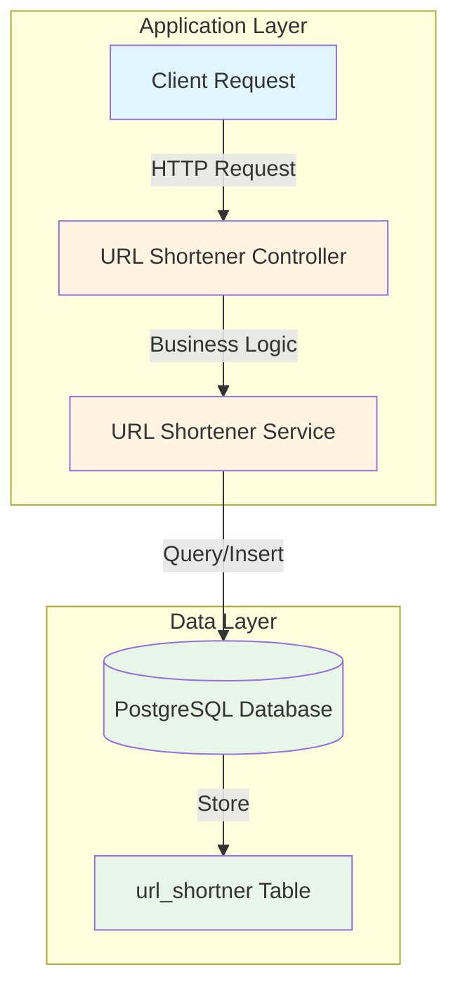
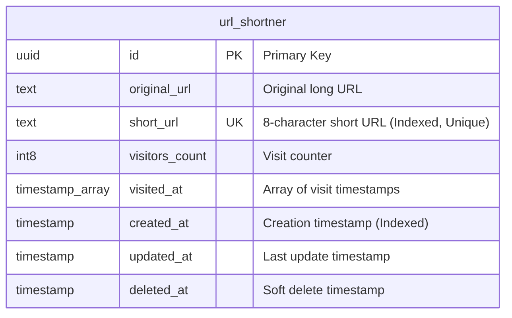
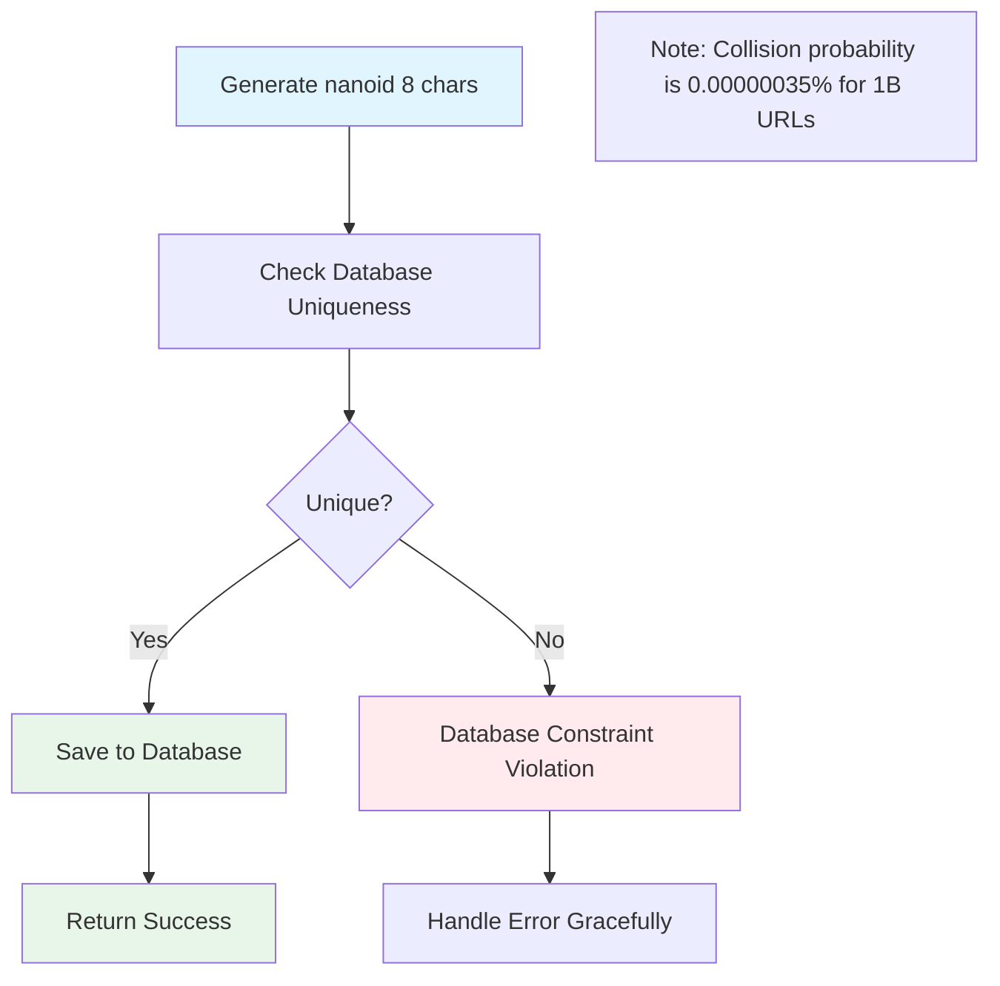
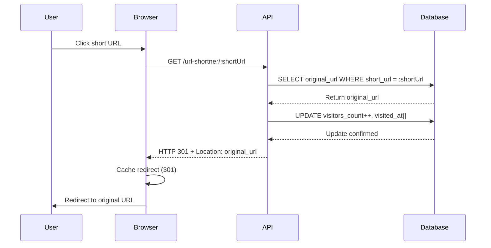
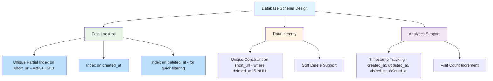

# URL Shortener Module - System Design Documentation

A comprehensive system design documentation for the URL shortener service that converts long URLs into short, shareable links with efficient storage, collision-free generation, and redirect mechanisms.

## Table of Contents

- [Overview](#overview)
- [System Design](#system-design)
- [Storage Architecture](#storage-architecture)
- [Collision Handling](#collision-handling)
- [Redirect Mechanism](#redirect-mechanism)
- [Database Schema](#database-schema)

## Overview

The URL Shortener module provides a RESTful API for:
- Creating short URLs from long URLs
- Redirecting short URLs to their original destinations
- Tracking visitor statistics (count and visit timestamps)

The service uses **nanoid** to generate unique 8-character short URL identifiers. With 64^8 (281,474,976,710,656) possible combinations, collisions are practically impossible for real-world usage.

## System Design

### Architecture Flow



### Component Architecture



## Storage Architecture

### Short → Long URL Mapping

The system uses a **relational database (PostgreSQL)** with TypeORM for storing URL mappings. The storage strategy is designed for high-performance lookups and scalability.

#### Database Table Structure



#### Storage Strategy

1. **Indexing Strategy**:
   - **Unique Index on `short_url`**: Ensures no duplicates and provides O(log n) lookup performance
   - **Index on `created_at`**: Enables efficient analytics queries by creation date
   - **Partial Index on `short_url` + `deleted_at`**: Optimizes queries for active (non-deleted) URLs only

2. **Lookup Performance**:
   - Direct lookup by `short_url` uses unique index → O(log n) time complexity
   - Index keeps B-tree structure optimized for fast retrieval
   - Partial index reduces index size by excluding deleted records

3. **Scalability Considerations**:
   - **Vertical Scaling**: PostgreSQL can handle millions of URLs with proper indexing
   - **Horizontal Scaling**: Can implement sharding based on short URL prefix or hash
   - **Caching Layer**: Redis can cache frequently accessed short→long mappings
   - **Read Replicas**: Separate read replicas for redirect operations (read-heavy workload)

#### Lookup Process Flow

```mermaid
flowchart TD
    A[GET Request: /url-shortner/:shortUrl] --> B[Extract shortUrl parameter]
    B --> C[Query Database: SELECT * FROM url_shortner WHERE short_url = :shortUrl]
    C --> D{Record Found?}
    D -->|Yes| E[Return original_url]
    D -->|No| F[Return 404 Not Found]
    E --> G[Update Analytics: visitors_count++, visited_at[]]
    G --> H[Return HTTP 301 Redirect]
    
    style A fill:#e1f5ff
    style E fill:#e8f5e9
    style F fill:#ffebee
    style H fill:#fff4e1
```

### Why PostgreSQL?

- **ACID Compliance**: Ensures data integrity and consistency
- **Relational Structure**: Supports complex analytics queries and relationships
- **Array Support**: Native support for timestamp arrays without JSON overhead
- **Indexing**: Advanced indexing capabilities (B-tree, partial indexes, unique constraints)
- **Scalability**: Can handle millions of URLs with proper schema design
- **Consistency**: Strong consistency guarantees for URL mappings

## Collision Handling

### Nanoid Collision Analysis

The system uses **nanoid** with 8 characters to generate short URLs. The collision probability is effectively zero for practical purposes:

- **Character Set**: URL-safe characters (A-Za-z0-9_-) = 64 characters
- **Length**: 8 characters
- **Total Combinations**: 64^8 = **281,474,976,710,656** (281+ trillion)
- **Collision Probability**: 
  - For 1 billion URLs: ~0.00000035%
  - For 10 billion URLs: ~0.000035%
  - For 100 billion URLs: ~0.0035%

### Collision-Free Guarantee

**8-character nanoid cannot collide in practice** because:

1. **Massive Space**: 281 trillion combinations provide an enormous namespace
2. **Uniform Distribution**: nanoid uses cryptographically strong random generation
3. **Database Uniqueness**: Unique index on `short_url` ensures no duplicates at database level
4. **Practical Impossibility**: Even with billions of URLs, collision probability remains negligible

### Collision Prevention Mechanism



The unique index constraint on `short_url` acts as the final safeguard, preventing any duplicate entries even in the astronomically unlikely event of a collision.

## Redirect Mechanism

### HTTP 301 Permanent Redirect

The system uses **HTTP 301 (Moved Permanently)** for redirects, which is the standard approach for URL shorteners.

### Why HTTP 301?

- **SEO Benefits**: Search engines transfer link equity and ranking signals to the original URL
- **Cacheability**: Browsers and intermediate proxies cache the redirect, reducing server load
- **Performance**: Subsequent requests may be served from browser cache
- **Semantics**: Short URLs are permanent mappings to original URLs (not temporary)
- **User Experience**: Transparent redirect - users don't see intermediate steps

### Redirect Flow



### Analytics Tracking During Redirect

Every redirect operation performs atomic updates:

1. **Increment Visitor Count**: `visitors_count = visitors_count + 1`
2. **Append Timestamp**: `visited_at = visited_at || current_timestamp`
3. **Update Record**: Single database transaction ensures consistency

This provides analytics without requiring separate tracking endpoints or external services.

### Redirect Performance


The indexed lookup ensures O(log n) performance, and the 301 redirect allows browsers to cache the mapping, reducing database load for frequently accessed URLs.

## Database Schema

### Entity Structure

The database entity includes all necessary fields with proper indexing:

- **Primary Key**: `id` (UUID) - Unique identifier for each record
- **Original URL**: `original_url` (TEXT) - The long URL to be shortened
- **Short URL**: `short_url` (TEXT) - The 8-character generated identifier
  - **Unique Index**: Prevents duplicates and ensures fast lookups
- **Analytics**:
  - `visitors_count` (INT8) - Total number of visits
  - `visited_at` (TIMESTAMP[]) - Array of visit timestamps
- **Timestamps**:
  - `created_at` (TIMESTAMP) - Record creation time (Indexed for analytics)
  - `updated_at` (TIMESTAMP) - Last update time
  - `deleted_at` (TIMESTAMP) - Soft delete timestamp (nullable)

### Index Strategy

The entity defines three indexes:

1. **Unique Partial Index on `short_url` (where not soft-deleted)**: 
   - Prevents collisions among active (non-deleted) records
   - Ensures O(log n) lookups and robust redirect operations
   - Only indexes records where `deleted_at IS NULL`
   - Syntax: `CREATE UNIQUE INDEX {index_name} ON {table_name} ({column_name}) WHERE {condition};`
   - Code: 
     ```
     CREATE UNIQUE INDEX shortUrl_unique_active_urls
       ON urls (shortUrl)
       WHERE deleted_at IS NULL;
     ```

2. **Index on `created_at`**: 
   - Enables efficient analytics queries by date range
   - Supports time-based filtering and reporting
   - Syntax : `CREATE INDEX {index_name} ON {table_name} ({column_name});`
   - Code : `CREATE INDEX idx_created_at ON short_url(created_at) WHERE deleted_at IS NOT NULL;`

3. **Index on `deleted_at`**: 
   - Enables efficient filtering of soft-deleted records
   - Supports cleanup operations and data retention policies
   - Syntax : `CREATE INDEX {index_name} ON {table_name} ({column_name});`
   - Code : `CREATE INDEX idx_deleted_at ON short_url(deleted_at);`

### Schema Design Principles




### Storage Estimates

- **Per Record Size**: ~1KB (includes all fields and overhead)
- **1 Million URLs**: ~1GB storage
- **1 Billion URLs**: ~1TB storage
- **Index Overhead**: ~30-40% additional storage for indexes

The combination of proper indexing and efficient data types ensures optimal performance even at scale.
